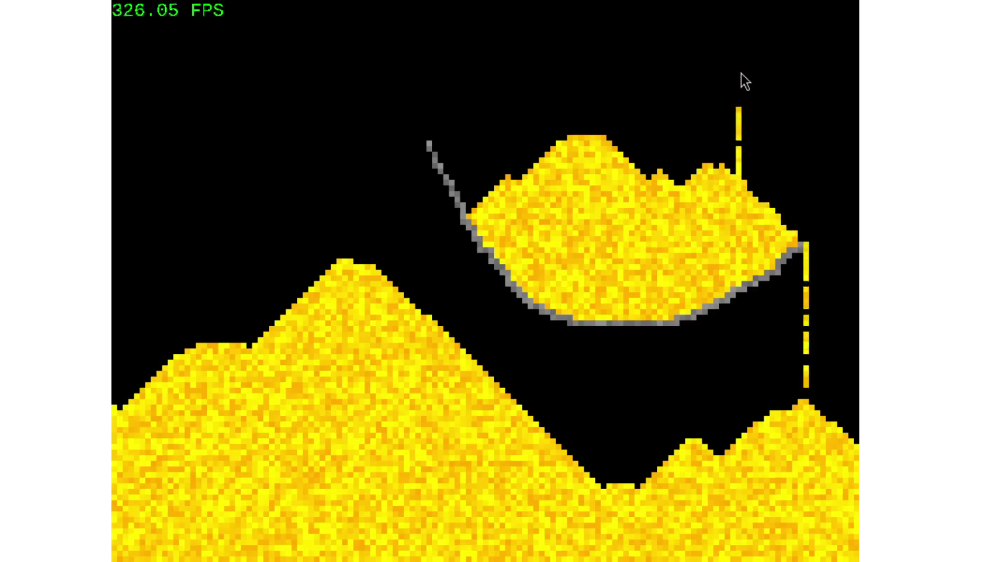

# Falling Sand Simulation

## Images and Videos

## Description

This project is a falling sand simulation with added stone and the ability to erase stuff. The simulation allows you to create and interact with different types of particles, such as sand, stone, and air. You can draw particles on the screen, and they will behave according to their properties, such as falling, stacking, and erasing.

## Features

- Falling sand simulation
- Added stone particles
- Ability to erase particles
- Real-time interaction with particles
- Adjustable brush size and probability

## Purpose

The purpose of this project is to provide a simple and interactive simulation of falling sand and other particles. It demonstrates basic physics principles and allows users to experiment with different particle types and behaviors.

## Functionality

- Sand particles fall and stack on top of each other
- Stone particles are static and do not move
- Air particles erase other particles
- Adjustable brush size and probability for drawing particles
- Real-time rendering and interaction

## Building

This project supports building using make in:
- Windows x86 and x64 with automatic install of SDL2 and SLD_ttf
- Linux, manual install of sdl and sdl_ttf needed 
